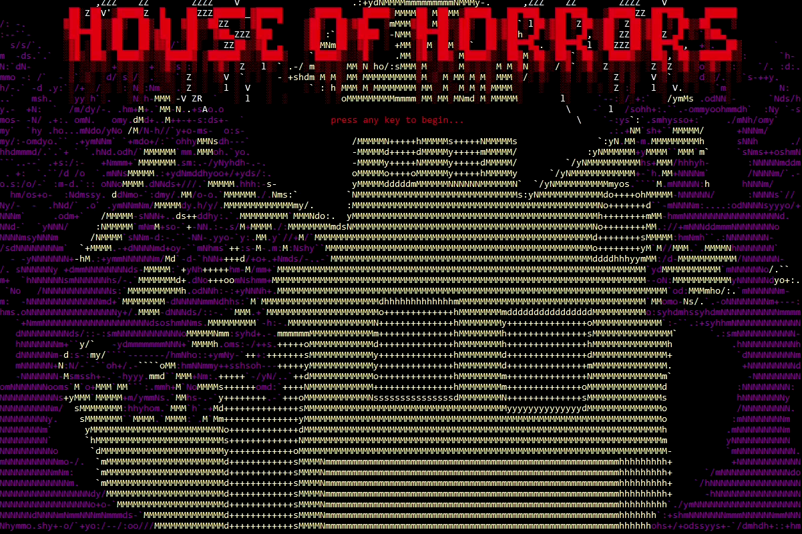

# BadASCII
BadASCII is a simple API for drawing stuff in the console. TextAdventure is an example of it in use.

### TODO:
- Create an API reference.
- Clean up the code in TextAdventure to make it presentable :)
- Finish TextAdventure.
